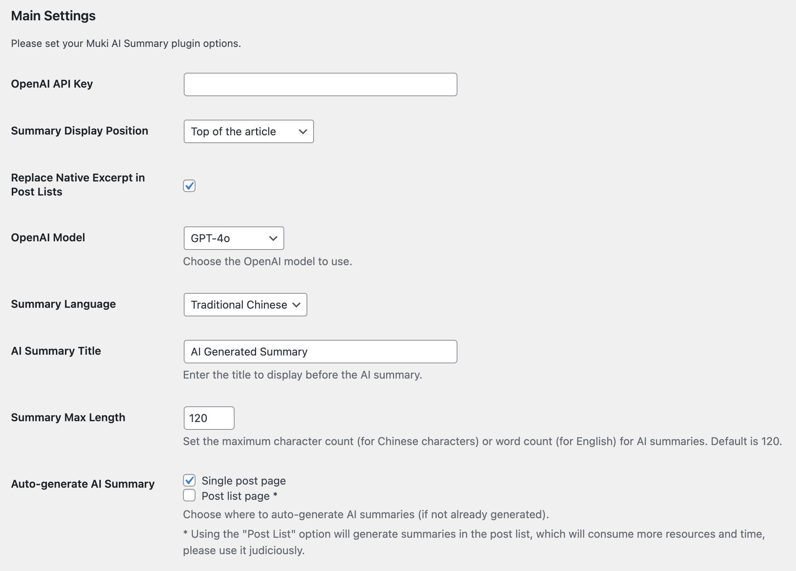
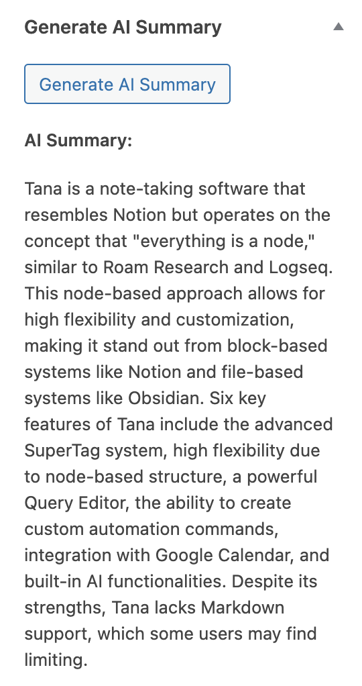
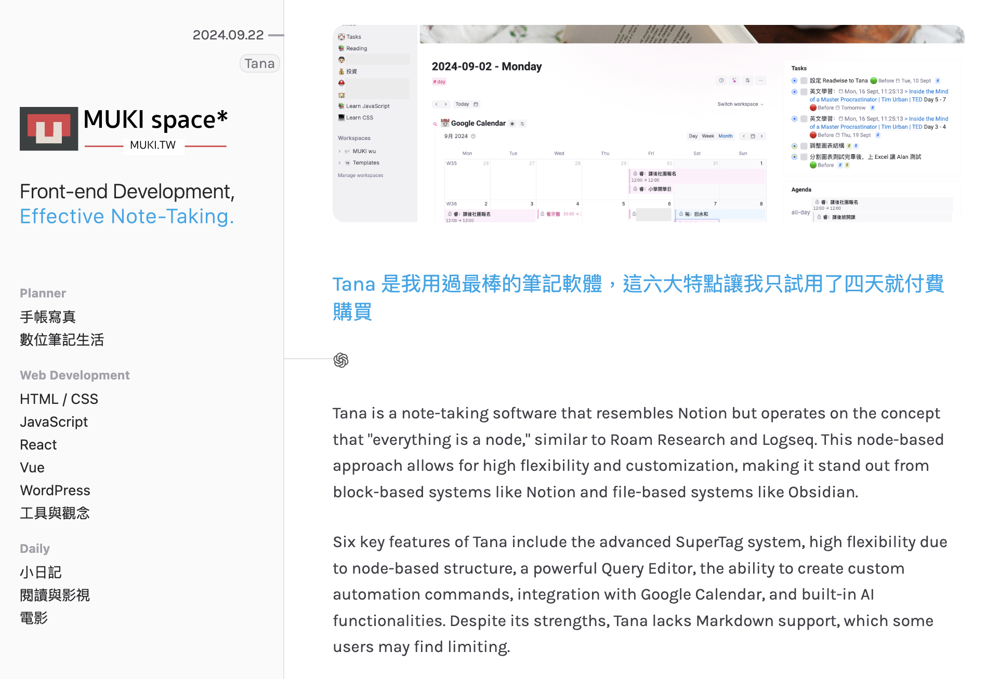
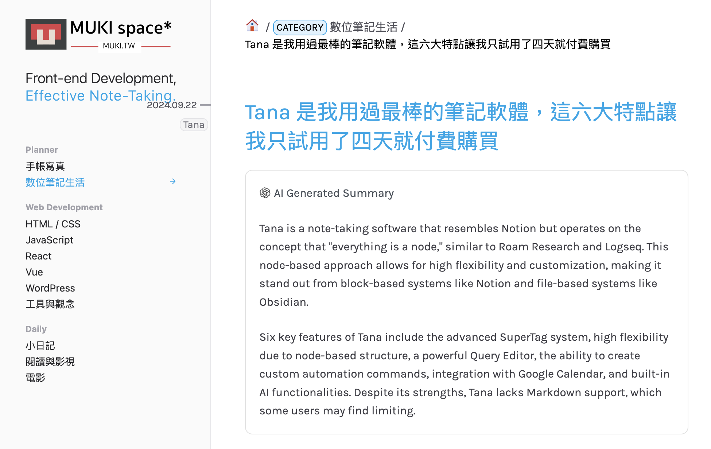

=== Muki AI Summary ===
Contributors: muki
Plugin URI: https://muki.tw/muki-ai-summary
Tags: ai, summary, content
Requires at least: 5.0
Tested up to: 6.2
Stable tag: 1.0.0
Requires PHP: 7.2
License: GPLv2 or later
License URI: https://www.gnu.org/licenses/gpl-2.0.html

Generate article summaries using Open AI.

== Description ==

Muki AI Summary integrates with Open AI Key to help you automatically generate article summaries.
This tool allows your readers to quickly understand the main content of the article, improving user experience and increasing website engagement.

Main features:
* Automatically generate article summaries
* Two models to choose from
  * GPT 3.5 turbo
* GPT 4o
* Customizable summary length
* Supports multiple languages
  * English
  * Traditional Chinese
  * Simplified Chinese
  * Japanese
* Easy-to-use settings interface

== Installation ==

1. Upload the `muki-ai-summary` folder to the `/wp-content/plugins/` directory
2. Activate the Muki AI Summary plugin in the `Plugins` section of WordPress
3. Go to `Settings > Muki AI Summary` to configure

== Frequently Asked Questions ==

= How does this plugin work? =

Administrators can generate a summary by clicking Generate AI Summary in the sidebar while editing an article;

If Auto-generate Ai Summary is checked, readers will automatically generate article summaries when browsing the blog:

Checking Single post page: Generates article summaries when browsing a single article
Checking Post list page: Generates article summaries for all articles on the page (may take more time and money, please use with caution)

= Can I customize the length of the summary? =

Yes, you can customize the length of the summary in the plugin settings.

= How do I get the Open AI Key? =

You can get the Open AI Key from [Open AI](https://openai.com/).

== Screenshots ==

1. Plugin settings interface

 

2. Generate AI summary button in the sidebar

 

3. AI summary example in the post list page

 

4. AI summary example in the article

 

== Changelog ==

= 1.0.0 =
* Initial version release

== Upgrade Notice ==

= 1.0.0 =
This is the first release of Muki AI Summary.
